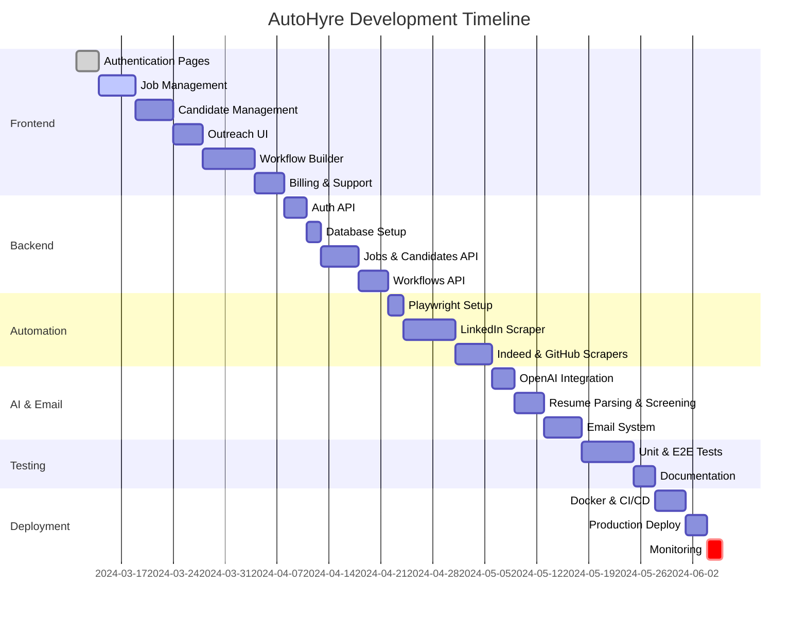

# AutoHyre - GitHub Project Plan

Complete development roadmap with milestones, labels, and visualization strategy.

---

## 📊 GitHub Project Setup

### Project Views to Create

1. **Board View (Kanban)** - Classic TODO → In Progress → Done
2. **Table View** - Spreadsheet with custom fields (Priority, Effort, Assignee)
3. **Roadmap View** - Timeline visualization with milestones
4. **Custom View: By Milestone** - Group issues by milestone
5. **Custom View: By Label** - Group by Frontend/Backend/DevOps

### How to Visualize & Showcase

**In GitHub:**
- **Projects → Roadmap tab** - Shows timeline with milestone dates
- **Projects → Insights** - Generate burndown charts, velocity graphs
- **Milestones page** - `/milestones` shows % complete per milestone
- **Projects → Table view** - Export to CSV for external tools

**External Showcase Tools:**
- **Linear** - Import GitHub issues, beautiful roadmap UI
- **Notion** - Sync GitHub via API, create public roadmap page
- **Mermaid Gantt Chart** - In README.md (shown below)
- **GitHub Profile README** - Embed project shields/progress bars

---

## 🏷️ Labels (Tags)

Create these labels in your repo:

### By Component
- 🎨 `frontend` - Frontend/UI work
- ⚙️ `backend` - Backend/API work
- 🗄️ `database` - Database schema/migrations
- 🤖 `scraper` - Web scraping tasks
- 🧠 `ai` - AI/ML integration
- 🚀 `devops` - Deployment/infrastructure

### By Priority
- 🔥 `critical` - Must have for MVP
- ⭐ `high` - Important for launch
- 📌 `medium` - Nice to have
- 💡 `low` - Future enhancement

### By Type
- ✨ `feature` - New functionality
- 🐛 `bug` - Bug fix
- 📝 `docs` - Documentation
- 🎨 `design` - UI/UX work
- 🔧 `refactor` - Code improvement
- 🧪 `testing` - Tests

### By Status
- 🚧 `in-progress` - Currently working
- 👀 `in-review` - Ready for review
- ⏸️ `blocked` - Waiting on dependency
- ✅ `ready` - Ready to start

---

## 🎯 Milestones

### Milestone 1: Frontend MVP (Week 1-3)
**Due:** 3 weeks from start  
**Goal:** Complete all user-facing pages  
**Success Criteria:** User can navigate entire app, create jobs, view candidates

**Issues:** #1-21 (Authentication, Jobs, Candidates, Outreach, Workflows UI, Billing, Support)

### Milestone 2: Backend Core (Week 4-6)
**Due:** 6 weeks from start  
**Goal:** Build API and database  
**Success Criteria:** All API endpoints working, data persists

**Issues:** #22-40 (Auth API, Jobs API, Candidates API, Database schema, Workflow storage)

### Milestone 3: Scrapers & Automation (Week 7-9)
**Due:** 9 weeks from start  
**Goal:** Working LinkedIn/Indeed/GitHub scrapers  
**Success Criteria:** Can post jobs and scrape candidates automatically

**Issues:** #41-55 (Playwright setup, LinkedIn scraper, Indeed scraper, GitHub API, Proxy integration)

### Milestone 4: AI & Email (Week 10-11)
**Due:** 11 weeks from start  
**Goal:** AI screening and email campaigns functional  
**Success Criteria:** Candidates auto-scored, emails sent

**Issues:** #56-65 (OpenAI integration, Resume parsing, Email templates, SMTP setup)

### Milestone 5: Testing & Polish (Week 12-13)
**Due:** 13 weeks from start  
**Goal:** Bug-free, tested, documented  
**Success Criteria:** All tests passing, docs complete

**Issues:** #66-75 (Unit tests, Integration tests, E2E tests, Documentation)

### Milestone 6: Deployment (Week 14)
**Due:** 14 weeks from start  
**Goal:** Live in production  
**Success Criteria:** Deployed, accessible, monitored

**Issues:** #76-85 (Docker setup, CI/CD, Monitoring, Domain setup)

---

## 📋 Complete Issue List

### 🎨 FRONTEND (Milestone 1)

#### Authentication & User Management

**#1 Sign Up Page** `frontend` `critical` `feature`
```
Create user registration page

Tasks:
- [ ] Create /app/signup/page.tsx
- [ ] Email + password form with Zod validation
- [ ] Password strength indicator component
- [ ] Terms of service checkbox
- [ ] API integration POST /api/v1/auth/register
- [ ] Error handling (email exists, weak password)
- [ ] Redirect to onboarding after signup

Acceptance Criteria:
- User can register with email/password
- Form validates all fields
- Shows appropriate error messages
- Redirects to dashboard on success

Estimate: 5 hours
```

**#2 Login Page** `frontend` `critical` `feature`
```
Create user login page

Tasks:
- [ ] Create /app/login/page.tsx
- [ ] Email + password form
- [ ] "Remember me" checkbox
- [ ] "Forgot password" link
- [ ] JWT token storage in localStorage
- [ ] Redirect to dashboard on success
- [ ] Show error for invalid credentials

Acceptance Criteria:
- User can login with valid credentials
- Token persists across page reloads
- Invalid login shows error

Estimate: 3 hours
```

**#3 User Profile Page** `frontend` `high` `feature`
```
Create user profile management page

Tasks:
- [ ] Create /app/profile/page.tsx
- [ ] Display user info (name, email, company)
- [ ] Edit profile form
- [ ] Change password section
- [ ] Profile picture upload (optional)
- [ ] PATCH /api/v1/users/me integration
- [ ] Success/error toast notifications

Acceptance Criteria:
- User can view their profile
- Can update name, email, company
- Can change password
- Shows success message on update

Estimate: 4 hours
```

#### Job Management

**#4 Job Card Component** `frontend` `critical` `feature`
```
Create reusable job card component

Tasks:
- [ ] Create components/jobs/JobCard.tsx
- [ ] Display: title, location, status, candidate count
- [ ] Actions dropdown: View, Edit, Archive, Delete
- [ ] Status badge (Active, Paused, Closed)
- [ ] Click to navigate to job detail
- [ ] Responsive design (mobile-friendly)
- [ ] Hover effects and animations

Acceptance Criteria:
- Card displays all job info
- Actions work correctly
- Looks good on mobile and desktop

Estimate: 4 hours
```

**#5 Job Detail View** `frontend` `critical` `feature`
```
Create job detail page

Tasks:
- [ ] Create /app/jobs/[id]/page.tsx
- [ ] Fetch job data from API
- [ ] Display full job description (markdown support)
- [ ] Show requirements as list
- [ ] Display applicant stats (total, new, qualified)
- [ ] List all candidates for this job
- [ ] Edit job button → navigate to edit form
- [ ] Archive/Delete confirmation modals

Acceptance Criteria:
- Shows all job details
- Lists associated candidates
- Can edit or delete job
- Confirms destructive actions

Estimate: 5 hours
```

#### Candidate Management

**#6 Candidate Card Component** `frontend` `critical` `feature`
```
Create candidate card component

Tasks:
- [ ] Create components/candidates/CandidateCard.tsx
- [ ] Display: name, email, AI score badge
- [ ] Show GitHub/LinkedIn icons with links
- [ ] Stage indicator pill (Sourced, Screening, Interview)
- [ ] Quick actions: View profile, Email, Move stage
- [ ] Score color coding:
  - Red (#EF4444) for score < 50
  - Yellow (#F59E0B) for 50-75
  - Green (#10B981) for > 75
- [ ] Avatar with initials fallback

Acceptance Criteria:
- Card shows all candidate info
- Score badge uses correct colors
- Links open in new tab
- Actions trigger correctly

Estimate: 5 hours
```

**#7 Candidate Profile Page** `frontend` `critical` `feature`
```
Create detailed candidate profile view

Tasks:
- [ ] Create /app/candidates/[id]/page.tsx
- [ ] Fetch candidate from API
- [ ] Layout sections:
  - Hero: Name, email, score, stage
  - AI Analysis: Score + reasoning display
  - Links: GitHub, LinkedIn, Resume (download)
  - Timeline: Activity feed (sourced, contacted, responded)
  - Notes: Rich text editor for recruiter notes
- [ ] Actions bar:
  - Send email button
  - Move to stage dropdown
  - Reject button (with confirmation)
- [ ] Auto-save notes on blur

Acceptance Criteria:
- Shows complete candidate profile
- AI reasoning clearly displayed
- Can add/edit notes
- Can move candidate to different stage
- Timeline shows all activities

Estimate: 8 hours
```

#### Outreach Management

**#8 Outreach Campaigns List** `frontend` `high` `feature`
```
Create email campaigns overview page

Tasks:
- [ ] Create /app/outreach/page.tsx
- [ ] Fetch campaigns from GET /api/v1/campaigns
- [ ] Display campaign cards with metrics:
  - Name, template used
  - Sent count, open rate %, response rate %
  - Status (Draft, Active, Completed)
  - Created date
- [ ] Filter by status dropdown
- [ ] Search campaigns by name
- [ ] Create new campaign button
- [ ] Click card → view campaign details

Acceptance Criteria:
- Lists all campaigns
- Metrics displayed correctly
- Can filter and search
- Navigate to create page

Estimate: 4 hours
```

**#9 Create Email Campaign** `frontend` `high` `feature`
```
Create new campaign wizard

Tasks:
- [ ] Create /app/outreach/new/page.tsx
- [ ] Multi-step form:
  Step 1: Campaign name, select recipients
  Step 2: Choose email template
  Step 3: Preview and schedule
- [ ] Recipient selector:
  - Filter by job, stage, score
  - Show count of selected candidates
- [ ] Template dropdown with preview
- [ ] Variable replacement preview
- [ ] Schedule options: Send now / Schedule for later
- [ ] POST /api/v1/campaigns integration

Acceptance Criteria:
- Can select recipients with filters
- Preview shows actual data
- Can schedule or send immediately
- Validates required fields

Estimate: 8 hours
```

**#10 Email Template Editor** `frontend` `medium` `feature`
```
Rich text email template creator

Tasks:
- [ ] Create components/outreach/TemplateEditor.tsx
- [ ] Integrate TipTap or Quill editor
- [ ] Subject line input
- [ ] Variable picker button:
  - {{candidate.name}}
  - {{candidate.email}}
  - {{job.title}}
  - {{company.name}}
- [ ] Click variable → insert at cursor
- [ ] Preview mode toggle
- [ ] Save template button
- [ ] Load existing templates

Acceptance Criteria:
- Rich text editing works
- Variables can be inserted
- Preview renders correctly
- Templates save/load

Estimate: 6 hours
```

#### Workflows & Automation

**#11 Workflow List Page** `frontend` `critical` `feature`
```
Display all automation workflows

Tasks:
- [ ] Create /app/workflows/page.tsx
- [ ] Fetch workflows from API
- [ ] Workflow cards showing:
  - Name, description
  - Trigger type (Manual, Scheduled, Job Posted)
  - Last run time, next run time
  - Success rate % (green/red indicator)
  - Active/Inactive toggle
- [ ] Create new workflow button
- [ ] Duplicate workflow action
- [ ] Delete workflow (with confirmation)

Acceptance Criteria:
- Lists all workflows
- Can toggle active status
- Can duplicate workflows
- Navigate to builder

Estimate: 4 hours
```

**#12 Workflow Builder Canvas** `frontend` `critical` `feature`
```
React Flow visual workflow builder

Tasks:
- [ ] Create /app/workflows/[id]/edit/page.tsx
- [ ] Integrate React Flow library
- [ ] Drag actions from sidebar to canvas
- [ ] Connect nodes with edges
- [ ] Delete nodes/edges (Delete key)
- [ ] Zoom/pan controls
- [ ] Save workflow button
- [ ] Auto-save draft every 30s
- [ ] Undo/Redo functionality

Acceptance Criteria:
- Can drag/drop actions
- Can connect nodes
- Can delete nodes
- Saves workflow state
- UI is intuitive

Estimate: 10 hours
```

**#13 Workflow Action Library** `frontend` `critical` `feature`
```
Draggable action sidebar

Tasks:
- [ ] Create components/workflows/ActionLibrary.tsx
- [ ] Categorized action list:
  - 🔍 Search: GitHub, LinkedIn, Indeed
  - 🧠 Filter: AI Screening, Manual Filter
  - 📧 Action: Send Email, Add to Pipeline, Wait
- [ ] Action cards with:
  - Icon, name, description
  - Draggable handle
- [ ] Search/filter actions
- [ ] Collapsible categories

Acceptance Criteria:
- All action types listed
- Can drag to canvas
- Search filters correctly
- Categories collapse/expand

Estimate: 4 hours
```

**#14 Action Configuration Panel** `frontend` `critical` `feature`
```
Dynamic form for configuring workflow actions

Tasks:
- [ ] Create components/workflows/ActionConfig.tsx
- [ ] Click node → show config panel
- [ ] Dynamic form based on action type:
  - Search GitHub: skills (array), location (text)
  - AI Screen: min_score (number 0-100)
  - Send Email: template (dropdown), subject (text)
  - Add to Pipeline: stage (dropdown)
- [ ] Variable picker for text fields
- [ ] Validation before saving
- [ ] Close panel button

Acceptance Criteria:
- Shows correct fields per action
- Validates inputs
- Variables can be inserted
- Updates node on save

Estimate: 6 hours
```

**#15 Workflow Execution History** `frontend` `medium` `feature`
```
View past workflow runs

Tasks:
- [ ] Create /app/workflows/[id]/executions/page.tsx
- [ ] Fetch executions from API
- [ ] Table showing:
  - Run ID, timestamp
  - Status (Success, Failed, Running)
  - Duration
  - Results summary (e.g., "12 candidates found, 8 emailed")
- [ ] Expandable row showing:
  - Each action executed
  - Action results
  - Error messages (if failed)
- [ ] Re-run workflow button
- [ ] Pagination

Acceptance Criteria:
- Lists all executions
- Can expand to see details
- Can re-run workflow
- Handles pagination

Estimate: 5 hours
```

#### Billing & Subscription

**#16 Billing Page** `frontend` `high` `feature`
```
Subscription and usage dashboard

Tasks:
- [ ] Create /app/billing/page.tsx
- [ ] Display current plan:
  - Plan name (Free, Pro, Enterprise)
  - Price/month
  - Features included
- [ ] Usage metrics for current month:
  - Candidates screened (progress bar)
  - Emails sent (progress bar)
  - Workflows executed
- [ ] Upgrade plan button
- [ ] Payment method section
- [ ] Billing history table (date, amount, invoice PDF)

Acceptance Criteria:
- Shows current plan
- Usage displays correctly
- Can upgrade plan
- Billing history listed

Estimate: 5 hours
```

**#17 Upgrade Plan Modal** `frontend` `high` `feature`
```
Plan selection and Stripe checkout

Tasks:
- [ ] Create components/billing/UpgradePlan.tsx
- [ ] Display plan tiers:
  - Free: $0, basic features
  - Pro: $49/mo, 500 candidates
  - Enterprise: $199/mo, unlimited
- [ ] Monthly/Annual toggle (show savings)
- [ ] Feature comparison table
- [ ] Select plan button
- [ ] Stripe Checkout integration
- [ ] POST /api/v1/billing/checkout
- [ ] Redirect to Stripe hosted page

Acceptance Criteria:
- Shows all plans
- Toggle between monthly/annual
- Redirects to Stripe checkout
- Handles errors gracefully

Estimate: 6 hours
```

**#18 Payment Method Management** `frontend` `medium` `feature`
```
Manage credit cards with Stripe

Tasks:
- [ ] Stripe Elements integration
- [ ] Add payment method form
- [ ] Display saved cards (last 4 digits)
- [ ] Set default card
- [ ] Delete card (with confirmation)
- [ ] POST /api/v1/billing/payment-methods

Acceptance Criteria:
- Can add new card
- Lists existing cards
- Can set default
- Can delete card

Estimate: 4 hours
```

#### Support & Help

**#19 Support Page** `frontend` `medium` `feature`
```
Help and contact page

Tasks:
- [ ] Create /app/support/page.tsx
- [ ] FAQ accordion (10+ common questions)
- [ ] Contact form:
  - Name, Email, Subject, Message
  - Category dropdown (Bug, Feature Request, Question)
- [ ] POST /api/v1/support/tickets
- [ ] Success message after submit
- [ ] Links to documentation
- [ ] Optional: Intercom chat widget

Acceptance Criteria:
- FAQ is searchable
- Contact form submits
- Shows confirmation
- Links to docs work

Estimate: 4 hours
```

**#20 Help Center** `frontend` `low` `feature`
```
Documentation and tutorials

Tasks:
- [ ] Create /app/help/page.tsx
- [ ] Categories:
  - Getting Started
  - Creating Workflows
  - Understanding AI Scoring
  - Billing & Plans
- [ ] Searchable article list
- [ ] Markdown article renderer
- [ ] Next/Previous navigation
- [ ] Embed video tutorials (YouTube)

Acceptance Criteria:
- Docs are searchable
- Articles render correctly
- Navigation works
- Videos play

Estimate: 5 hours
```

#### Dashboard & Analytics

**#21 Analytics Dashboard** `frontend` `critical` `feature`
```
Main dashboard with metrics and charts

Tasks:
- [ ] Update /app/dashboard/page.tsx
- [ ] Key metric cards:
  - Total candidates (with % change)
  - Active workflows count
  - Email response rate %
  - Avg time-to-hire (days)
- [ ] Charts (using Recharts):
  - Candidates by source (pie chart)
  - Weekly activity (line chart)
  - AI score distribution (bar chart)
- [ ] Recent activity feed
- [ ] Quick actions: Create job, Create workflow

Acceptance Criteria:
- All metrics display correctly
- Charts render with real data
- Responsive on mobile
- Quick actions work

Estimate: 8 hours
```

---

### ⚙️ BACKEND (Milestone 2)

#### Authentication & Users

**#22 User Registration API** `backend` `critical` `feature`
```
Create user signup endpoint

Tasks:
- [ ] Create app/api/v1/auth.py
- [ ] POST /api/v1/auth/register endpoint
- [ ] Pydantic schema: email, password validation
- [ ] Hash password with bcrypt
- [ ] Check if email exists
- [ ] Create user in database
- [ ] Return JWT token
- [ ] Send welcome email

Acceptance Criteria:
- Accepts email/password
- Validates input
- Returns JWT on success
- Returns 400 if email exists

Estimate: 3 hours
```

**#23 Login API** `backend` `critical` `feature`
```
User authentication endpoint

Tasks:
- [ ] POST /api/v1/auth/login
- [ ] Validate email/password
- [ ] Check password hash
- [ ] Generate JWT token (expires in 7 days)
- [ ] Return token + user info
- [ ] Rate limit: 5 attempts per minute

Acceptance Criteria:
- Returns token for valid credentials
- Returns 401 for invalid
- Rate limiting works

Estimate: 2 hours
```

**#24 User Profile APIs** `backend` `high` `feature`
```
User CRUD operations

Tasks:
- [ ] GET /api/v1/users/me (get current user)
- [ ] PATCH /api/v1/users/me (update profile)
- [ ] POST /api/v1/users/me/change-password
- [ ] JWT middleware for auth
- [ ] Update user model

Acceptance Criteria:
- Protected endpoints require JWT
- Can update user info
- Can change password
- Returns updated user

Estimate: 3 hours
```

#### Database Setup

**#25 Database Models** `database` `critical` `feature`
```
Create SQLAlchemy models

Tasks:
- [ ] Create app/models/user.py
- [ ] Create app/models/job.py
- [ ] Create app/models/candidate.py
- [ ] Create app/models/workflow.py
- [ ] Create app/models/campaign.py
- [ ] Define relationships (foreign keys)
- [ ] Add timestamps (created_at, updated_at)

Acceptance Criteria:
- All models created
- Relationships defined correctly
- Timestamps auto-populate

Estimate: 4 hours
```

**#26 Database Migrations** `database` `critical` `feature`
```
Setup Alembic migrations

Tasks:
- [ ] Initialize Alembic
- [ ] Create initial migration
- [ ] Run migration to create tables
- [ ] Add indexes:
  - candidates.email
  - candidates.job_id
  - workflows.user_id
- [ ] Document migration commands

Acceptance Criteria:
- Migrations run successfully
- Tables created in PostgreSQL
- Indexes added

Estimate: 2 hours
```

#### Job Management API

**#27 Jobs CRUD API** `backend` `critical` `feature`
```
Job management endpoints

Tasks:
- [ ] POST /api/v1/jobs (create job)
- [ ] GET /api/v1/jobs (list all jobs)
- [ ] GET /api/v1/jobs/{id} (get single job)
- [ ] PATCH /api/v1/jobs/{id} (update job)
- [ ] DELETE /api/v1/jobs/{id} (delete job)
- [ ] Pydantic schemas for validation
- [ ] Filter by status (active, paused, closed)
- [ ] Pagination (limit, offset)

Acceptance Criteria:
- All CRUD operations work
- Returns 404 for missing jobs
- Pagination works
- Validates input

Estimate: 4 hours
```

**#28 Job Candidates Endpoint** `backend` `high` `feature`
```
List candidates for a specific job

Tasks:
- [ ] GET /api/v1/jobs/{id}/candidates
- [ ] Filter by stage (sourced, screening, etc.)
- [ ] Filter by AI score (min/max)
- [ ] Sort by score, date
- [ ] Pagination
- [ ] Return candidate count per stage

Acceptance Criteria:
- Returns candidates for job
- Filters work correctly
- Pagination works
- Counts are accurate

Estimate: 3 hours
```

#### Candidates API

**#29 Candidates CRUD API** `backend` `critical` `feature`
```
Candidate management endpoints

Tasks:
- [ ] POST /api/v1/candidates (create manually)
- [ ] GET /api/v1/candidates (list all)
- [ ] GET /api/v1/candidates/{id} (get single)
- [ ] PATCH /api/v1/candidates/{id} (update)
- [ ] DELETE /api/v1/candidates/{id}
- [ ] Filter by job_id, stage, score
- [ ] Search by name, email
- [ ] Pagination

Acceptance Criteria:
- CRUD operations work
- Filters and search work
- Pagination works
- Returns 404 for missing

Estimate: 4 hours
```

**#30 Candidate Notes API** `backend` `medium` `feature`
```
Recruiter notes for candidates

Tasks:
- [ ] POST /api/v1/candidates/{id}/notes
- [ ] GET /api/v1/candidates/{id}/notes
- [ ] PATCH /api/v1/notes/{note_id}
- [ ] DELETE /api/v1/notes/{note_id}
- [ ] Create notes table/model
- [ ] Link to user (who wrote note)

Acceptance Criteria:
- Can add notes to candidates
- Can edit/delete own notes
- Notes returned with candidate

Estimate: 3 hours
```

#### Workflows API

**#31 Workflows CRUD API** `backend` `critical` `feature`
```
Workflow management endpoints

Tasks:
- [ ] POST /api/v1/workflows (create)
- [ ] GET /api/v1/workflows (list all)
- [ ] GET /api/v1/workflows/{id} (get single)
- [ ] PATCH /api/v1/workflows/{id} (update)
- [ ] DELETE /api/v1/workflows/{id}
- [ ] Store actions as JSONB
- [ ] Toggle active status

Acceptance Criteria:
- CRUD operations work
- Actions stored correctly
- Can enable/disable workflow

Estimate: 4 hours
```

**#32 Execute Workflow API** `backend` `critical` `feature`
```
Trigger workflow execution

Tasks:
- [ ] POST /api/v1/workflows/{id}/execute
- [ ] Queue workflow in Redis
- [ ] Return execution_id immediately (202 Accepted)
- [ ] Background worker picks up task
- [ ] Execute actions sequentially
- [ ] Log results to workflow_executions table
- [ ] Handle errors gracefully

Acceptance Criteria:
- Returns immediately (async)
- Workflow executes in background
- Results logged to database
- Errors don't crash system

Estimate: 6 hours
```

**#33 Workflow Executions API** `backend` `high` `feature`
```
View workflow execution history

Tasks:
- [ ] GET /api/v1/workflows/{id}/executions
- [ ] Return list of past runs
- [ ] Include status, results, errors
- [ ] Pagination
- [ ] Filter by status (success, failed)

Acceptance Criteria:
- Lists all executions
- Shows detailed results
- Pagination works

Estimate: 2 hours
```

#### Email Campaigns API

**#34 Campaigns CRUD API** `backend` `high` `feature`
```
Email campaign management

Tasks:
- [ ] POST /api/v1/campaigns (create)
- [ ] GET /api/v1/campaigns (list)
- [ ] GET /api/v1/campaigns/{id} (get single)
- [ ] PATCH /api/v1/campaigns/{id} (update)
- [ ] DELETE /api/v1/campaigns/{id}
- [ ] Store template, recipients
- [ ] Track sent count, open rate

Acceptance Criteria:
- CRUD operations work
- Recipients stored as array
- Metrics tracked

Estimate: 4 hours
```

**#35 Send Campaign API** `backend` `high` `feature`
```
Execute email campaign

Tasks:
- [ ] POST /api/v1/campaigns/{id}/send
- [ ] Load campaign and recipients
- [ ] Render email template with variables
- [ ] Send via SMTP in batches
- [ ] Add 3-5s delay between emails
- [ ] Update sent count
- [ ] Log each email sent

Acceptance Criteria:
- Emails sent successfully
- Delays prevent rate limiting
- Metrics updated correctly

Estimate: 5 hours
```

---

### 🤖 SCRAPERS & AUTOMATION (Milestone 3)

**#36 Playwright Setup** `scraper` `critical` `feature`
```
Configure Playwright for scraping

Tasks:
- [ ] Install Playwright + browsers
- [ ] Install stealth plugin
- [ ] Create base scraper class
- [ ] Configure proxy settings
- [ ] Add user-agent rotation
- [ ] Setup error logging

Acceptance Criteria:
- Playwright launches successfully
- Proxies work
- Stealth mode enabled

Estimate: 3 hours
```

**#37 LinkedIn Scraper - Job Posting** `scraper` `critical` `feature`
```
Automate LinkedIn job posting

Tasks:
- [ ] Create app/scrapers/linkedin.py
- [ ] Login automation
- [ ] Navigate to job posting form
- [ ] Fill job details
- [ ] Handle CAPTCHAs (2Captcha integration)
- [ ] Submit and get job ID
- [ ] Random delays (human-like)
- [ ] Save job ID to database

Acceptance Criteria:
- Successfully posts job
- Handles CAPTCHAs
- No immediate bans

Estimate: 8 hours
```

**#38 LinkedIn Scraper - Applicant Scraping** `scraper` `critical` `feature`
```
Scrape LinkedIn job applicants

Tasks:
- [ ] Navigate to job applicants page
- [ ] Scroll to load all applicants
- [ ] Extract: name, headline, location, profile URL
- [ ] Save to candidates table
- [ ] Handle pagination
- [ ] Error handling for blocked requests

Acceptance Criteria:
- Scrapes all applicants
- Data saved correctly
- Handles errors gracefully

Estimate: 6 hours
```

**#39 Indeed Scraper - Job Posting** `scraper` `critical` `feature`
```
Automate Indeed job posting

Tasks:
- [ ] Create app/scrapers/indeed.py
- [ ] Login automation
- [ ] Fill job posting form
- [ ] Set application redirect to our URL
- [ ] Submit and get job ID
- [ ] Save to database

Acceptance Criteria:
- Posts job successfully
- Redirect URL set correctly
- Job ID captured

Estimate: 6 hours
```

**#40 Indeed Scraper - Applicant Scraping** `scraper` `high` `feature`
```
Scrape Indeed applicants

Tasks:
- [ ] Navigate to applicants page
- [ ] Extract applicant data
- [ ] Download resumes (if available)
- [ ] Save to candidates table
- [ ] Handle "Apply with Indeed Resume"

Acceptance Criteria:
- Scrapes applicant data
- Saves to database
- Handles different apply methods

Estimate: 5 hours
```

**#41 GitHub API Integration** `scraper` `critical` `feature`
```
Search developers on GitHub

Tasks:
- [ ] Create app/scrapers/github.py
- [ ] Use GitHub Search API
- [ ] Filter by:
  - Programming languages
  - Location
  - Min repos count
- [ ] Extract: name, email, bio, repos
- [ ] Save to candidates table
- [ ] Handle rate limiting (5000 requests/hour)

Acceptance Criteria:
- Searches GitHub successfully
- Respects rate limits
- Data extracted correctly

Estimate: 4 hours
```

**#42 Proxy Manager** `scraper` `critical` `feature`
```
Manage residential proxy rotation

Tasks:
- [ ] Create app/scrapers/proxy_manager.py
- [ ] Load proxies from config
- [ ] Rotate proxies per request
- [ ] Test proxy before use
- [ ] Remove dead proxies
- [ ] Integration with Smartproxy API

Acceptance Criteria:
- Proxies rotate correctly
- Dead proxies removed
- Integrates with scrapers

Estimate: 4 hours
```

---

### 🧠 AI & EMAIL (Milestone 4)

**#43 OpenAI Integration** `ai` `critical` `feature`
```
Setup OpenAI API client

Tasks:
- [ ] Install OpenAI SDK
- [ ] Create app/ai/client.py
- [ ] Configure API key
- [ ] Create base screening prompt
- [ ] Handle rate limits
- [ ] Add retry logic

Acceptance Criteria:
- Can call OpenAI API
- Handles errors
- Retry on rate limit

Estimate: 2 hours
```

**#44 Resume Parser** `ai` `critical` `feature`
```
Extract text from PDF/DOCX resumes

Tasks:
- [ ] Install PyPDF2, python-docx
- [ ] Create app/ai/resume_parser.py
- [ ] Extract text from PDF
- [ ] Extract text from DOCX
- [ ] Clean extracted text
- [ ] Return structured data

Acceptance Criteria:
- Parses PDF resumes
- Parses DOCX resumes
- Text is clean

Estimate: 3 hours
```

**#45 AI Candidate Screening** `ai` `critical` `feature`
```
Score candidates with GPT-4

Tasks:
- [ ] Create app/ai/screening.py
- [ ] Build prompt with job requirements
- [ ] Include candidate data (resume, GitHub)
- [ ] Request JSON response with score + reasoning
- [ ] Parse GPT-4 response
- [ ] Save score to candidate record
- [ ] Handle API errors

Acceptance Criteria:
- Scores candidates 0-100
- Returns reasoning
- Saves to database

Estimate: 4 hours
```

**#46 Email Template System** `backend` `high` `feature`
```
Create email template renderer

Tasks:
- [ ] Create app/services/email.py
- [ ] Create templates table
- [ ] Variable replacement engine:
  - {{candidate.name}}
  - {{job.title}}
  - {{company.name}}
- [ ] HTML email support
- [ ] Template CRUD API

Acceptance Criteria:
- Templates store in database
- Variables replace correctly
- HTML renders properly

Estimate: 4 hours
```

**#47 SMTP Email Sending** `backend` `critical` `feature`
```
Send emails via SMTP

Tasks:
- [ ] Configure SMTP settings
- [ ] Gmail OAuth integration (optional)
- [ ] Create email sending function
- [ ] Add retry logic
- [ ] Track sent emails in database
- [ ] Handle bounces/errors

Acceptance Criteria:
- Sends emails successfully
- Tracks delivery status
- Handles errors

Estimate: 4 hours
```

**#48 Email Campaign Scheduler** `backend` `high` `feature`
```
Schedule email sends

Tasks:
- [ ] Integrate with Redis queue
- [ ] Create cron job for checking scheduled campaigns
- [ ] Execute campaigns at scheduled time
- [ ] Batch sending (100 emails at a time)
- [ ] Add delays between batches

Acceptance Criteria:
- Campaigns send at scheduled time
- Batching works
- Delays prevent rate limiting

Estimate: 4 hours
```

---

### 🧪 TESTING (Milestone 5)

**#49 Backend Unit Tests** `testing` `high` `feature`
```
Write pytest unit tests

Tasks:
- [ ] Setup pytest
- [ ] Test auth endpoints
- [ ] Test CRUD operations
- [ ] Test workflow execution
- [ ] Test AI screening
- [ ] Mock external APIs
- [ ] Aim for 70% coverage

Acceptance Criteria:
- All critical paths tested
- Tests pass
- Coverage > 70%

Estimate: 12 hours
```

**#50 Frontend Component Tests** `testing` `medium` `feature`
```
Test React components

Tasks:
- [ ] Setup Jest + React Testing Library
- [ ] Test JobCard component
- [ ] Test CandidateCard component
- [ ] Test forms (signup, login)
- [ ] Test workflow builder interactions
- [ ] Aim for 60% coverage

Acceptance Criteria:
- Key components tested
- Tests pass
- Coverage > 60%

Estimate: 10 hours
```

**#51 E2E Tests** `testing` `high` `feature`
```
End-to-end testing with Playwright

Tasks:
- [ ] Setup Playwright (testing, not scraping)
- [ ] Test user signup flow
- [ ] Test job creation flow
- [ ] Test workflow creation flow
- [ ] Test candidate pipeline flow
- [ ] Run in CI/CD

Acceptance Criteria:
- Critical user flows tested
- Tests run automatically
- All tests pass

Estimate: 8 hours
```

**#52 API Documentation** `docs` `high` `feature`
```
Complete API docs

Tasks:
- [ ] Write endpoint descriptions
- [ ] Add request/response examples
- [ ] Document error codes
- [ ] Create Postman collection
- [ ] FastAPI auto-docs customization

Acceptance Criteria:
- All endpoints documented
- Examples provided
- Swagger UI polished

Estimate: 4 hours
```

**#53 User Documentation** `docs` `medium` `feature`
```
Write user guides

Tasks:
- [ ] Getting Started guide
- [ ] Workflow creation tutorial
- [ ] AI screening explanation
- [ ] FAQ document
- [ ] Video tutorials (optional)

Acceptance Criteria:
- Guides written
- Clear and concise
- Screenshots included

Estimate: 6 hours
```

---

### 🚀 DEPLOYMENT (Milestone 6)

**#54 Docker Setup** `devops` `critical` `feature`
```
Containerize application

Tasks:
- [ ] Create Dockerfile for backend
- [ ] Create Dockerfile for frontend
- [ ] Create docker-compose.yml
- [ ] Include PostgreSQL + Redis
- [ ] Environment variable management
- [ ] Test local Docker deployment

Acceptance Criteria:
- App runs in Docker
- All services connect
- Easy to start with one command

Estimate: 4 hours
```

**#55 CI/CD Pipeline** `devops` `critical` `feature`
```
Automate testing and deployment

Tasks:
- [ ] Create GitHub Actions workflow
- [ ] Run tests on PR
- [ ] Auto-deploy to staging on merge to main
- [ ] Auto-deploy to production on tag
- [ ] Slack notifications

Acceptance Criteria:
- Tests run automatically
- Deploys work
- Notifications sent

Estimate: 5 hours
```

**#56 Railway/Render Deployment** `devops` `critical` `feature`
```
Deploy backend to production

Tasks:
- [ ] Create Railway/Render account
- [ ] Deploy FastAPI backend
- [ ] Configure environment variables
- [ ] Connect to Supabase PostgreSQL
- [ ] Connect to Upstash Redis
- [ ] Setup custom domain

Acceptance Criteria:
- Backend accessible
- Database connected
- Domain configured

Estimate: 3 hours
```

**#57 Vercel Deployment** `devops` `critical` `feature`
```
Deploy frontend to Vercel

Tasks:
- [ ] Connect GitHub repo to Vercel
- [ ] Configure build settings
- [ ] Set environment variables
- [ ] Setup custom domain
- [ ] Enable auto-deployments

Acceptance Criteria:
- Frontend live on Vercel
- Auto-deploys on push
- Domain works

Estimate: 2 hours
```

**#58 Monitoring Setup** `devops` `high` `feature`
```
Setup error tracking and monitoring

Tasks:
- [ ] Integrate Sentry (error tracking)
- [ ] Setup uptime monitoring (UptimeRobot)
- [ ] Configure alerts (email/Slack)
- [ ] Add logging
- [ ] Create status page

Acceptance Criteria:
- Errors tracked
- Uptime monitored
- Alerts working

Estimate: 4 hours
```

---

## 📈 Gantt Chart (Timeline Visualization)



---

## 🎯 Progress Tracking

### How to Use This Plan

1. **Create GitHub Project**
   - Go to your repo → Projects → New project
   - Choose "Board" template
   - Add custom fields: Priority, Estimate, Milestone

2. **Create Issues**
   - Copy each issue above into GitHub Issues
   - Add appropriate labels
   - Assign to milestone
   - Add estimate in hours

3. **Link to Project**
   - Add all issues to your project board
   - Start in "TODO" column

4. **Track Progress**
   - Move cards as you work
   - Update project daily
   - Use Insights to see burndown

### Visualization Options

**In GitHub:**
```
Your Repo → Projects → AutoHyre
- Board view (Kanban)
- Table view (Spreadsheet)
- Roadmap view (Timeline with milestones)
```

**External Showcase:**
- Add this Gantt chart to README.md
- Create public roadmap page in Notion
- Use shields.io badges: 

### Progress Shields for README

```markdown


```

---

## 📊 Milestone Summary

| Milestone | Issues | Est. Hours | Target Date |
|-----------|--------|------------|-------------|
| 1. Frontend MVP | #1-21 | 112h | Week 3 |
| 2. Backend Core | #22-35 | 65h | Week 6 |
| 3. Scrapers | #36-42 | 46h | Week 9 |
| 4. AI & Email | #43-48 | 25h | Week 11 |
| 5. Testing | #49-53 | 40h | Week 13 |
| 6. Deployment | #54-58 | 18h | Week 14 |
| **TOTAL** | **58 issues** | **306h** | **~14 weeks** |

---

## 🎉 Definition of Done

**For Each Issue:**
- [ ] Code written and tested
- [ ] PR reviewed and approved
- [ ] Merged to main branch
- [ ] Deployed to staging
- [ ] Tested by user
- [ ] Documentation updated

**For Each Milestone:**
- [ ] All issues completed
- [ ] Demo recorded
- [ ] Stakeholders notified
- [ ] Retrospective held

---

**Start Date:** March 11, 2024  
**Target Launch:** June 7, 2024  
**Total Duration:** 14 weeks (3.5 months)