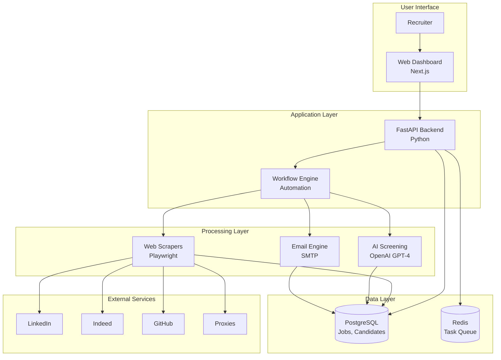
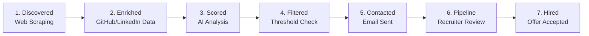

# System Architecture

Complete technical overview of AutoHyre's recruitment automation platform.

---

## Goals

AutoHyre aims to solve three core problems in recruitment:

1. **Manual Candidate Sourcing** - Eliminate hours spent searching LinkedIn, GitHub, and job boards
2. **Inconsistent Screening** - Replace subjective resume reviews with AI-powered scoring
3. **Repetitive Outreach** - Automate personalized email campaigns and follow-ups

**Target outcome:** Reduce time-to-hire by 60% while improving candidate quality through consistent, data-driven evaluation.

---

## System Overview



---

## How It Works

### User Journey

**1. Recruiter Creates Job**
```
Recruiter fills out job form (title, requirements, location)
  ↓
Frontend sends POST to /api/v1/jobs
  ↓
Backend saves job to PostgreSQL
  ↓
Returns job ID to frontend
```

**2. Recruiter Creates Workflow**
```
Recruiter opens workflow builder (React Flow)
  ↓
Drags actions: [Search GitHub] → [AI Screen] → [Send Email]
  ↓
Configures each action (skills, score threshold, template)
  ↓
Frontend sends workflow JSON to /api/v1/workflows
  ↓
Backend saves to PostgreSQL, sets up scheduler
```

**3. Workflow Executes Automatically**
```
Trigger fires (schedule, manual, or job posted)
  ↓
Workflow engine loads actions from database
  ↓
Executes actions sequentially:
  
  Action 1: Search GitHub
    - Calls GitHub API with skills filter
    - Finds 50 developers with React experience
    - Saves profiles to candidates table
  
  Action 2: AI Screening
    - For each candidate, extracts GitHub bio
    - Sends to OpenAI: "Score this candidate for Senior React role"
    - GPT-4 returns score (0-100) + reasoning
    - Filters out candidates below threshold (70)
    - Updates candidates with ai_score
  
  Action 3: Send Email
    - For qualified candidates (score >= 70)
    - Renders email template with variables
    - Sends via Gmail SMTP
    - Marks candidate as "contacted"
  
  ↓
All candidates now in pipeline with status "sourced"
```

**4. Recruiter Reviews Pipeline**
```
Dashboard shows Kanban board:
  - Sourced (12 candidates)
  - Screening (0)
  - Interview (0)
  
Recruiter clicks candidate card
  ↓
Sees AI score, reasoning, GitHub profile
  ↓
Drags to "Screening" stage or rejects
```

---

## Data Flow

### Candidate Journey Through System



### Information Collected Per Candidate

```
Discovery → Name, Email, GitHub URL
Enrichment → Repos, Languages, Contributions, Location
AI Scoring → Score (0-100), Reasoning, Skills Match
Tracking → Email opened, Responded, Interview scheduled
```

---

## Core Components

### 1. Frontend (Next.js)

**Purpose:** User interface for recruiters

**Key Features:**
- Job management (create, edit, archive)
- Visual workflow builder (React Flow drag-and-drop)
- Candidate pipeline (Kanban board)
- Analytics dashboard (metrics, charts)

**Tech:** TypeScript, Tailwind CSS, React Query for state management

---

### 2. Backend API (FastAPI)

**Purpose:** Business logic, data persistence, workflow orchestration

**Key Endpoints:**
- `POST /api/v1/jobs` - Create job
- `GET /api/v1/candidates` - List candidates
- `POST /api/v1/workflows` - Save workflow
- `POST /api/v1/workflows/{id}/execute` - Trigger workflow

**Tech:** Python, SQLAlchemy ORM, Pydantic validation

---

### 3. Workflow Engine

**Purpose:** Execute automated recruitment workflows

**How It Works:**
1. Load workflow JSON from database
2. Parse actions and trigger conditions
3. Execute actions sequentially
4. Pass data between actions via variables
5. Log execution results
6. Handle errors (retry, skip, stop)

**Scheduling:** Uses Redis + cron for timed executions

---

### 4. Web Scrapers (Playwright)

**Purpose:** Automate job posting and candidate discovery on LinkedIn/Indeed

**How It Works:**
```python
# Example: Post job to LinkedIn
1. Launch headless browser with proxy
2. Navigate to linkedin.com/login
3. Enter credentials (stored encrypted)
4. Navigate to job posting form
5. Fill fields with job data
6. Click submit
7. Save job ID to database
8. Close browser
```

**Anti-Detection:**
- Residential proxies (rotate IPs)
- Random delays (mimic human behavior)
- 2Captcha integration (solve CAPTCHAs)
- Stealth mode (hide automation flags)

**Risk:** Against ToS, accounts may get banned

---

### 5. AI Screening (OpenAI)

**Purpose:** Evaluate candidate fit using AI

**How It Works:**
```python
# Send to GPT-4
prompt = f"""
Job Requirements:
- 5+ years React
- TypeScript expert
- Remote experience

Candidate Profile:
- GitHub: 42 repos, 80% JavaScript
- Top language: TypeScript
- Contributions: 1,200 last year

Score this candidate 0-100 and explain why.
"""

response = openai.chat.completions.create(
    model="gpt-4",
    messages=[{"role": "user", "content": prompt}]
)

# Returns:
{
    "score": 85,
    "reasoning": "Strong TypeScript background, active contributor, fits requirements"
}
```

**Cost:** ~$0.02 per candidate screened

---

### 6. Email Engine

**Purpose:** Send automated outreach campaigns

**Features:**
- Template system with variables ({{candidate.name}})
- SMTP integration (Gmail, SendGrid)
- Batch sending with delays
- Track opens/clicks (optional)

**Daily Limits:**
- Gmail free: 100 emails/day
- SendGrid free: 100 emails/day
- Need paid plan for scale

---

## Database Schema

### Core Tables

**jobs**
```
id, title, description, requirements (JSONB), location, status, created_at
```

**candidates**
```
id, name, email, resume_url, github_url, linkedin_url, 
ai_score, ai_reasoning, stage, job_id, created_at
```

**workflows**
```
id, name, trigger_type, trigger_config (JSONB), 
actions (JSONB), active, user_id, created_at
```

**workflow_executions**
```
id, workflow_id, status, started_at, completed_at, 
results (JSONB), error_message
```

---

## External Dependencies

### Required Services

| Service | Purpose | Cost |
|---------|---------|------|
| **PostgreSQL** | Primary database | Free (self-hosted) |
| **Redis** | Task queue | Free (self-hosted) |
| **OpenAI API** | AI screening | ~$0.02/candidate |
| **Residential Proxies** | Scraping (Smartproxy) | $75+/month |
| **2Captcha** | CAPTCHA solving | $3/1000 solves |
| **Gmail/SendGrid** | Email sending | Free (100/day) |

### Optional Services

- **GitHub API** - Free, for developer search
- **Apollo.io** - $49/month, for LinkedIn data (legal alternative)
- **Supabase** - $25/month, managed PostgreSQL

---

## Deployment Architecture

### Development
```
localhost:3000 (Frontend)
localhost:8000 (Backend)
localhost:5432 (PostgreSQL)
localhost:6379 (Redis)
```

### Production
```
Vercel (Frontend)
Railway/Render (Backend)
Supabase (PostgreSQL)
Upstash (Redis)
```

**Estimated Monthly Cost:** $50-150 (excludes proxies)

---

## Security Considerations

### Data Protection
- Passwords encrypted with bcrypt
- JWT tokens for authentication
- API keys in environment variables
- Database credentials never committed

### Scraping Risks
- ⚠️ Violates LinkedIn/Indeed ToS
- ⚠️ Accounts may get banned
- ⚠️ IP addresses may get blocked
- ⚠️ Legal liability with user

**Mitigation:**
- Use residential proxies
- Rotate accounts
- Add random delays
- Limit request rates
- Have backup accounts ready

---

## Performance Characteristics

### Expected Throughput

| Operation | Speed | Notes |
|-----------|-------|-------|
| Job creation | <100ms | Simple database write |
| Candidate search (GitHub) | ~2 seconds | GitHub API call |
| Candidate search (LinkedIn) | ~30 seconds | Scraping with delays |
| AI screening (1 candidate) | ~3 seconds | OpenAI API call |
| Email sending (100 emails) | ~5 minutes | With 3s delays |
| Workflow execution | 5-30 min | Depends on actions |

### Bottlenecks

1. **Scraping speed** - Limited by delays to avoid detection
2. **AI screening** - Limited by OpenAI rate limits
3. **Email sending** - Limited by SMTP provider limits

---

## Scalability

### Current Limitations

- Sequential workflow execution (no parallelization)
- Single backend instance
- Manual proxy rotation
- No distributed task queue

### Future Improvements

- Parallel action execution
- Multi-instance backend with load balancer
- Auto-scaling scrapers with Kubernetes
- Distributed Redis queue
- Database read replicas

---

## Monitoring & Observability

### Key Metrics to Track

- Workflow execution success rate
- Average candidate score
- Email response rate
- Scraper ban rate
- API response times
- Database query performance

### Error Handling

- Workflow failures logged to database
- Email notifications for critical errors
- Retry logic for transient failures
- Fallback to manual execution

---

## Development Workflow

```
1. Local development
   - Frontend: npm run dev
   - Backend: uvicorn app.main:app --reload
   - Database: docker-compose up postgres redis

2. Testing
   - Frontend: npm test
   - Backend: pytest
   - Integration: Playwright tests

3. Deployment
   - Frontend: git push → Vercel auto-deploy
   - Backend: git push → Railway auto-deploy
   - Database: Alembic migrations

4. Monitoring
   - Check error logs
   - Review workflow execution stats
   - Monitor scraping success rates
```

---

## Next Steps

Once core system is working:

1. **Add more platforms** - Stack Overflow, AngelList, etc.
2. **Improve AI** - Fine-tune models, multi-stage screening
3. **Email intelligence** - Track responses, auto-follow-ups
4. **Team features** - Multi-user access, permissions
5. **Analytics** - Deeper insights, A/B testing
6. **Mobile app** - iOS/Android for on-the-go management

---

## Technical Debt & Trade-offs

### Current Shortcuts

- No user authentication (MVP assumes single user)
- Basic error handling (retry logic minimal)
- No rate limiting on API
- Workflows execute sequentially (slow)
- Limited test coverage

### Intentional Trade-offs

- **Scraping vs Official APIs** - Faster to build, riskier
- **Monolithic backend** - Simpler to deploy, harder to scale
- **No microservices** - Less complexity, more coupling
- **Basic UI** - Functional over beautiful, ship faster

These will be addressed as the product matures.