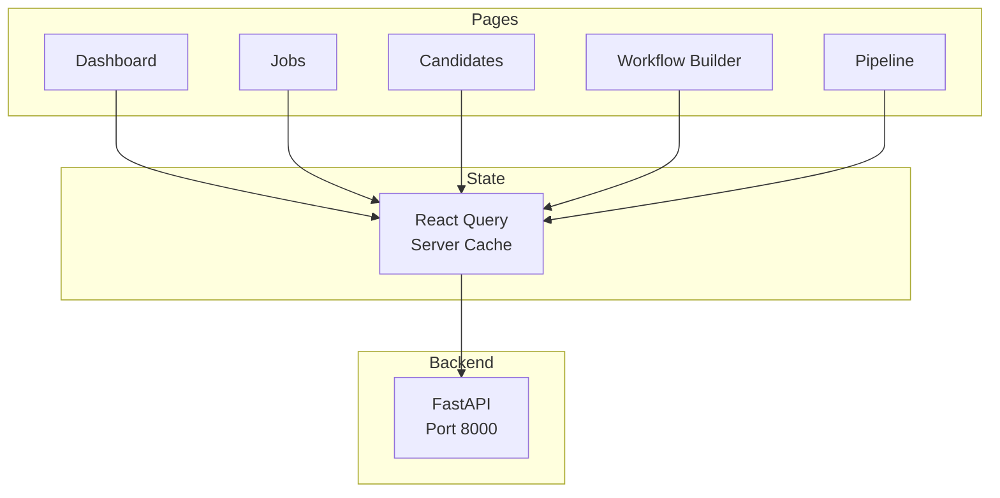

# Frontend Architecture

Next.js 14 application with TypeScript and React Flow for visual workflow building.

---

## How It Works

The frontend provides recruiters with an intuitive interface to manage the hiring process.

### User Flow

**1. Dashboard → Overview**
- Shows active jobs, candidate count, recent activity
- Quick actions: Create job, View pipeline

**2. Jobs → Post & Manage**
- Create job with title, description, requirements
- Edit/archive existing jobs
- View applicants per job

**3. Workflow Builder → Automate**
- Drag actions onto React Flow canvas
- Connect them in sequence
- Configure each action (skills, templates, thresholds)
- Save workflow → Backend executes it

**4. Candidates → Review**
- List all candidates with filters (score, stage, source)
- Click card to view full profile
- See AI score, reasoning, GitHub/LinkedIn links

**5. Pipeline → Track Progress**
- Kanban board: Sourced → Screening → Interview → Offer
- Drag candidates between stages
- Real-time updates when workflows run

### Goals

- **Zero learning curve** - Familiar patterns (drag-and-drop, Kanban)
- **Real-time updates** - React Query auto-refreshes data
- **Mobile responsive** - Works on tablets/phones
- **Fast performance** - Server components, optimistic updates

---

## Architecture



---

## Stack

- **Framework**: Next.js 14 (App Router)
- **Language**: TypeScript
- **UI**: Tailwind CSS, Radix UI, shadcn/ui
- **State**: React Query
- **Forms**: React Hook Form + Zod
- **Workflows**: React Flow

---

## Structure

```
app/
├── dashboard/          # Main dashboard
├── jobs/              # Job management
├── candidates/        # Candidate profiles
├── workflows/         # Workflow builder
└── pipeline/          # Kanban pipeline

components/
├── ui/                # shadcn/ui components
├── workflow/          # React Flow components
└── shared/            # Reusable components

lib/
├── api.ts             # API client
├── types.ts           # TypeScript types
└── utils.ts           # Helper functions
```

---

## Requirements

### System Requirements
- **Node.js** 18+ (LTS recommended)
- **Package Manager** npm or bun
- **Memory** 512MB minimum for dev server
- **Storage** 100MB for node_modules

### Browser Support
- Chrome/Edge 90+
- Firefox 88+
- Safari 14+

### Development Tools (Optional)
- VSCode with TypeScript extension
- React DevTools
- Tailwind CSS IntelliSense

---

## Setup

```bash
cd frontend
npm install
cp .env.example .env.local
npm run dev
```

---

## Environment Variables

```bash
NEXT_PUBLIC_API_URL=http://localhost:8000
NEXT_PUBLIC_APP_URL=http://localhost:3000
```