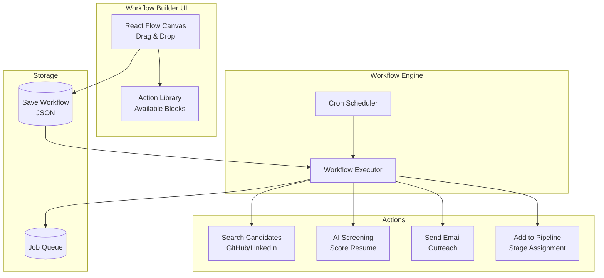

# Workflow System

Visual automation builder for creating recruitment workflows without code.

---

## Architecture



---

## How It Works

### 1. Visual Builder

Users create workflows by dragging action blocks onto a canvas and connecting them.

**Example Workflow:**
```
[New Job Posted] → [Search GitHub] → [AI Screen] → [Send Email] → [Add to Pipeline]
```

### 2. Workflow Storage

Workflows are saved as JSON in PostgreSQL:

```json
{
  "id": "wf_123",
  "name": "Auto-hire React developers",
  "trigger": {
    "type": "job_posted",
    "config": {"job_id": "job_456"}
  },
  "actions": [
    {
      "id": "action_1",
      "type": "search_github",
      "config": {
        "skills": ["React", "TypeScript"],
        "min_repos": 5
      }
    },
    {
      "id": "action_2",
      "type": "ai_screen",
      "config": {
        "min_score": 70
      }
    },
    {
      "id": "action_3",
      "type": "send_email",
      "config": {
        "template": "developer_outreach",
        "subject": "Exciting React opportunity"
      }
    },
    {
      "id": "action_4",
      "type": "add_to_pipeline",
      "config": {
        "stage": "screening"
      }
    }
  ],
  "active": true
}
```

### 3. Execution

When triggered, the engine executes actions sequentially:

1. **Trigger fires** (job posted, manual, scheduled)
2. **Engine loads workflow** from database
3. **Actions execute** in order
4. **Data flows** between actions via variables
5. **Results saved** to database

---

## Available Actions

### Search Actions

#### `search_github`
Search for developers on GitHub.

**Inputs:**
- `skills` (array): Programming languages/frameworks
- `location` (string, optional): Geographic location
- `min_repos` (number, optional): Minimum public repos

**Output:**
```json
{
  "candidates": [
    {
      "name": "John Doe",
      "github": "https://github.com/johndoe",
      "email": "john@example.com",
      "repos": 42,
      "languages": ["JavaScript", "TypeScript", "React"]
    }
  ]
}
```

#### `search_linkedin`
Search LinkedIn profiles (requires proxy).

**Inputs:**
- `keywords` (string): Search query
- `location` (string): Job location
- `max_results` (number): Limit results

**Output:**
```json
{
  "candidates": [
    {
      "name": "Jane Smith",
      "linkedin": "https://linkedin.com/in/janesmith",
      "headline": "Senior React Developer",
      "location": "San Francisco, CA"
    }
  ]
}
```

### AI Actions

#### `ai_screen`
Score candidates using AI.

**Inputs:**
- `min_score` (number): Threshold (0-100)
- `job_requirements` (array): Required skills

**Output:**
```json
{
  "score": 85,
  "reasoning": "Strong React experience, 5+ years...",
  "qualified": true
}
```

### Communication Actions

#### `send_email`
Send outreach emails.

**Inputs:**
- `template` (string): Email template name
- `subject` (string): Email subject
- `to` (string): Recipient (supports variables)

**Variables:**
- `{{candidate.name}}` - Candidate name
- `{{job.title}}` - Job title
- `{{company.name}}` - Company name

**Example:**
```
Subject: {{candidate.name}}, interested in {{job.title}}?

Hi {{candidate.name}},

I found your GitHub profile and was impressed by your work...
```

### Pipeline Actions

#### `add_to_pipeline`
Add candidate to hiring pipeline.

**Inputs:**
- `stage` (string): Pipeline stage (sourced, screening, interview, offer)
- `notify` (boolean): Send notification

---

## Triggers

### Manual Trigger
Execute workflow on demand via API or UI button.

### Job Posted Trigger
Runs when a new job is created.

```json
{
  "trigger": {
    "type": "job_posted",
    "config": {}
  }
}
```

### Schedule Trigger
Runs on cron schedule.

```json
{
  "trigger": {
    "type": "schedule",
    "config": {
      "cron": "0 9 * * *"  // Daily at 9am
    }
  }
}
```

### Webhook Trigger
Runs when external webhook is called.

```json
{
  "trigger": {
    "type": "webhook",
    "config": {
      "url": "/webhooks/workflow_123"
    }
  }
}
```

---

## Variable System

Actions can reference data from previous actions:

```json
{
  "actions": [
    {
      "id": "action_1",
      "type": "search_github",
      "config": {"skills": ["React"]}
    },
    {
      "id": "action_2",
      "type": "send_email",
      "config": {
        "to": "{{action_1.candidates[0].email}}",  // Reference previous action
        "subject": "Hi {{action_1.candidates[0].name}}"
      }
    }
  ]
}
```

---

## Error Handling

Workflows can handle errors:

```json
{
  "actions": [
    {
      "id": "action_1",
      "type": "search_linkedin",
      "on_error": "continue"  // Options: continue, stop, retry
    }
  ]
}
```

---

## Example Workflows

### 1. Daily GitHub Developer Search

```json
{
  "name": "Daily React dev search",
  "trigger": {"type": "schedule", "config": {"cron": "0 9 * * *"}},
  "actions": [
    {"type": "search_github", "config": {"skills": ["React"]}},
    {"type": "ai_screen", "config": {"min_score": 75}},
    {"type": "send_email", "config": {"template": "outreach"}},
    {"type": "add_to_pipeline", "config": {"stage": "sourced"}}
  ]
}
```

### 2. Auto-respond to Job Applications

```json
{
  "name": "Screen applications",
  "trigger": {"type": "application_received"},
  "actions": [
    {"type": "ai_screen", "config": {"min_score": 70}},
    {
      "type": "conditional",
      "if": "{{ai_screen.qualified}}",
      "then": [
        {"type": "send_email", "config": {"template": "interview_invite"}},
        {"type": "add_to_pipeline", "config": {"stage": "interview"}}
      ],
      "else": [
        {"type": "send_email", "config": {"template": "rejection"}}
      ]
    }
  ]
}
```

### 3. Weekly Passive Candidate Outreach

```json
{
  "name": "Weekly passive outreach",
  "trigger": {"type": "schedule", "config": {"cron": "0 10 * * 1"}},
  "actions": [
    {"type": "search_linkedin", "config": {"keywords": "Senior Engineer", "max_results": 50}},
    {"type": "ai_screen", "config": {"min_score": 80}},
    {"type": "send_email", "config": {"template": "passive_outreach"}},
    {"type": "wait", "config": {"days": 3}},
    {"type": "send_email", "config": {"template": "follow_up"}}
  ]
}
```

---

## API Usage

### Create Workflow

```bash
POST /api/v1/workflows
{
  "name": "My workflow",
  "trigger": {...},
  "actions": [...]
}
```

### Execute Workflow

```bash
POST /api/v1/workflows/{id}/execute
{
  "input_data": {"job_id": "123"}
}
```

### List Executions

```bash
GET /api/v1/workflows/{id}/executions
```

Response:
```json
{
  "executions": [
    {
      "id": "exec_123",
      "status": "completed",
      "started_at": "2024-03-10T10:00:00Z",
      "completed_at": "2024-03-10T10:05:32Z",
      "results": {
        "candidates_found": 15,
        "emails_sent": 12,
        "added_to_pipeline": 8
      }
    }
  ]
}
```

---

## Development

### Adding New Actions

1. Create action in `backend/app/workflows/actions.py`:

```python
async def send_sms(config: dict, context: dict) -> dict:
    """Send SMS to candidate"""
    phone = config.get("phone")
    message = config.get("message")
    
    # Send SMS via Twilio
    await twilio_client.send(phone, message)
    
    return {"sent": True, "phone": phone}
```

2. Register in action library:

```python
AVAILABLE_ACTIONS = {
    "send_sms": {
        "name": "Send SMS",
        "execute": send_sms,
        "inputs": [
            {"name": "phone", "type": "string", "required": True},
            {"name": "message", "type": "text", "required": True}
        ]
    }
}
```

3. Add UI component in frontend.

---

## Best Practices

1. **Test workflows manually** before scheduling
2. **Use min_score thresholds** to filter candidates
3. **Add delays** between actions to avoid rate limits
4. **Monitor execution logs** for errors
5. **Start with small batches** before scaling
6. **Use templates** for consistent messaging
7. **Set up error notifications** for failed workflows

---

## Limitations

- **Rate limits**: Don't scrape too aggressively
- **Proxy costs**: Residential proxies required for LinkedIn
- **AI costs**: OpenAI charges per candidate screened
- **Email limits**: SMTP providers have daily limits
- **Sequential only**: Actions run in order, no parallelization yet